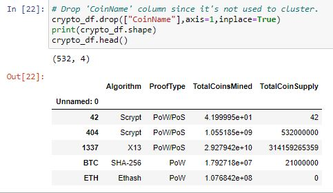
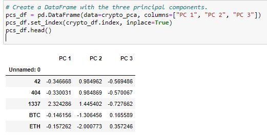
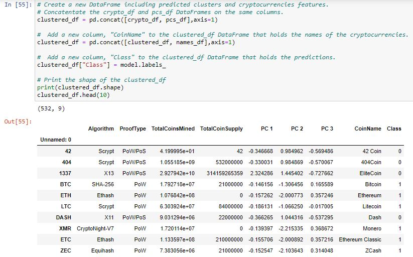
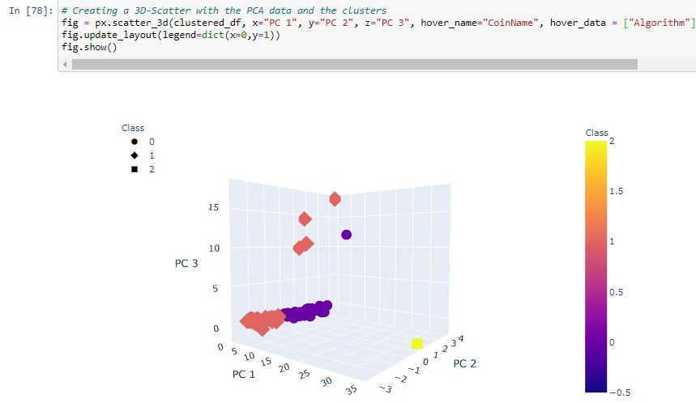
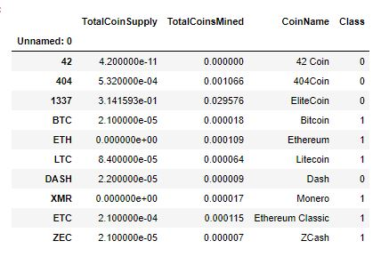
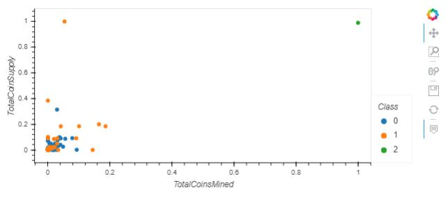

# Unsupervised Machine Learning with Cryptocurrencies

## Purpose
The purpose of this project is to analyze the cryptocurrency market to create a report about which cryptocurrencies are on the market, and how they can be grouped into a classification system for a client to potentially invest in. 

## Processing data for Principal Component Analysis

I used Pandas in Jupyter Notebook to process the data. I read my data in from a CSV from CyptoCompare into a dataframe. I narrowed down my dataframe to only cryptocurrencies that were currently being traded, has coins mined, and dropped null values or columns not useful for PCA. I also created a dataframe to hold the cryptocurrency names. This left me with the following: 

Next, I needed to use get_dummies() to make variabes for the text features "Algorithm" and "ProofType." Finally, I used the StandardScaler to standardize the DataFrame before analysis. 

## Reducing Dimensions with PCA
I used PCA to reduce to three principal components, then created a dataframe with these three components, setting the index to the index I used for my original dataframe.

## Cluster Cryptocurrencies with K-means
I created an elbow curve using hvPlot to determine that the best value for k was 4. Next, I used my dataframe to run the K-means algorithm and make predictions of the K clusters. I concatenatated all of this information together into one dataframe named clustered_df.

## Visualization 
To visualize the data I created 3D scatter plot using Plotly Express to plot the three clusters from my clustered_df with the "CoinName" and "Algorithm" in the pop up. 

I was also able to use hvplot to create a table of tradable cryptocurrencies of whic there were 532. I then used MinMaxScaler, which tranforms features by scaling them to a given range. I used this on "TotalCoinSupply" and "TotalCoinsMined" to scale them to a range between 0 and 1. I created a dataframe with these scaled values, the coin name, and class so I could create a scatter plot to show that information.

Final Dataframe             |  Final Scatter
:-------------------------:|:-------------------------:
  |  

